# OCI Report Automation - Architecture & Logic Documentation

## System Overview

The OCI Report Automation system is a serverless, event-driven solution that automatically processes and emails OCI usage reports when they are uploaded to Object Storage. The system uses OCI Functions, Resource Principal authentication, and integrates with multiple OCI services.

## Architecture Diagram

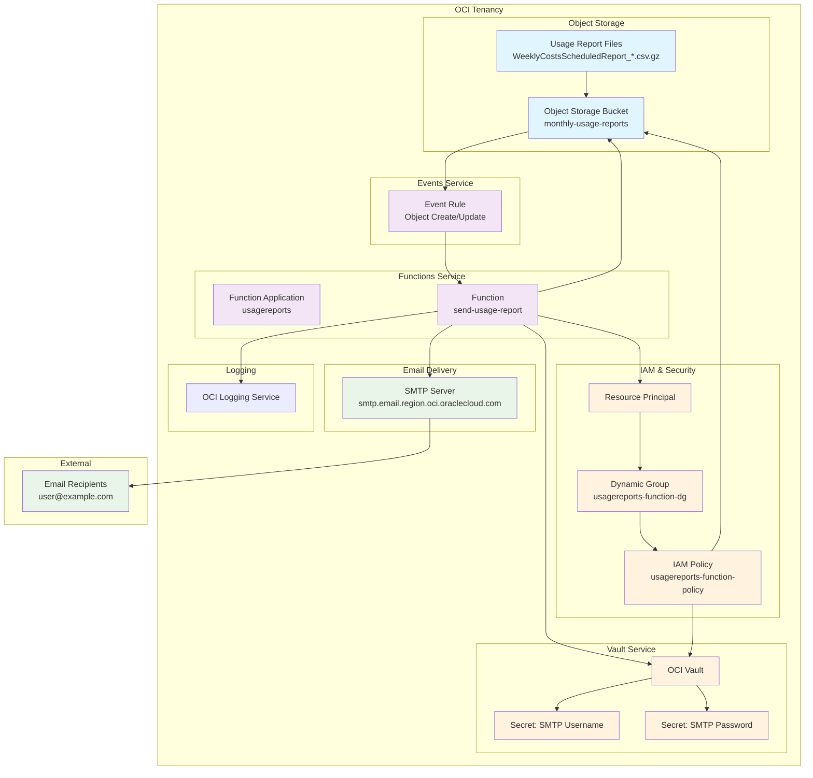

## Component Architecture

### 1. Trigger Layer
- **Object Storage Bucket**: Stores usage report files
- **Event Rule**: Monitors bucket for new/updated files
- **Event Payload**: Contains file metadata and triggers function

### 2. Compute Layer
- **OCI Function**: Serverless compute that processes events
- **Function Application**: Container for the function
- **Runtime Environment**: Python 3.11 with required dependencies

### 3. Security Layer
- **Resource Principal**: Enables function to authenticate without credentials
- **Dynamic Group**: Groups function resources for policy application
- **IAM Policies**: Grant specific permissions to function resources
- **OCI Vault**: Securely stores SMTP credentials

### 4. Integration Layer
- **Object Storage Client**: Downloads report files
- **Secrets Client**: Retrieves SMTP credentials
- **SMTP Client**: Sends emails with attachments
- **Logging Service**: Captures function execution logs

## Detailed Logic Flow

### Phase 1: Event Trigger
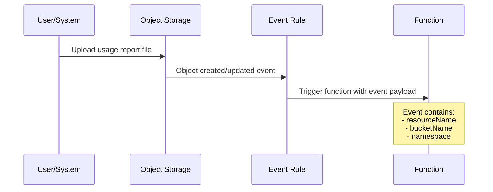

### Phase 2: Function Initialization
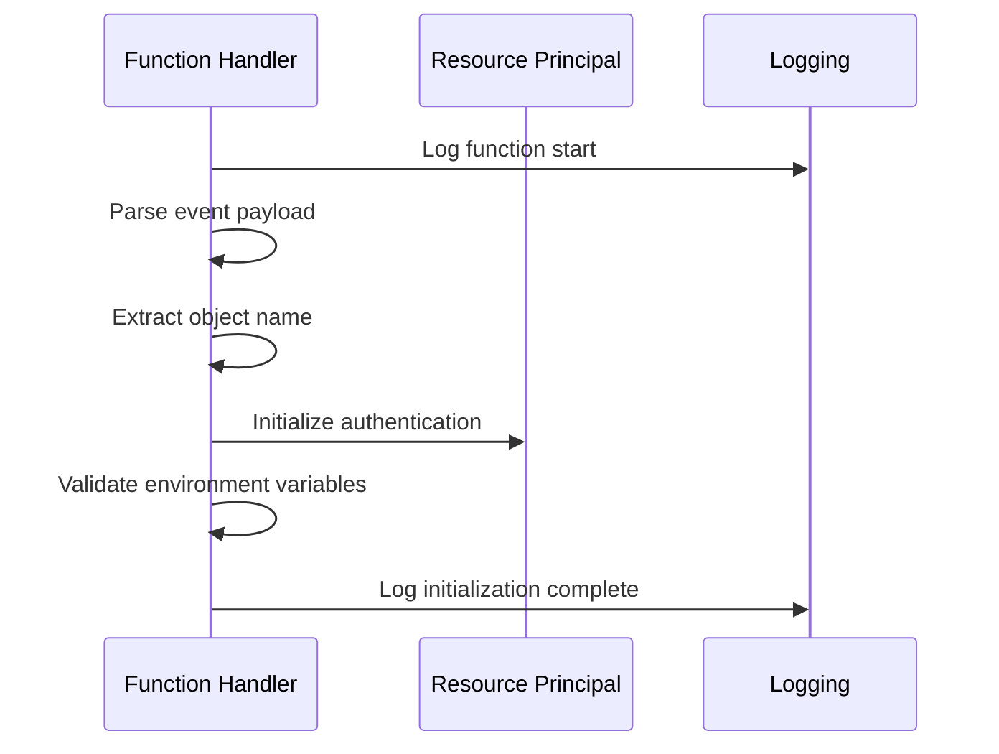

### Phase 3: File Processing
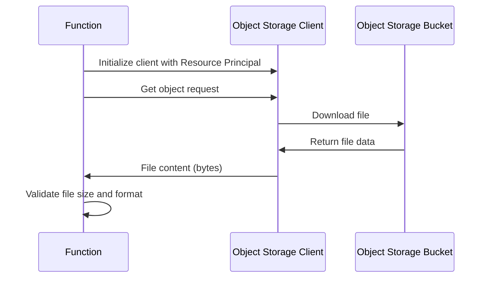

### Phase 4: Credential Retrieval
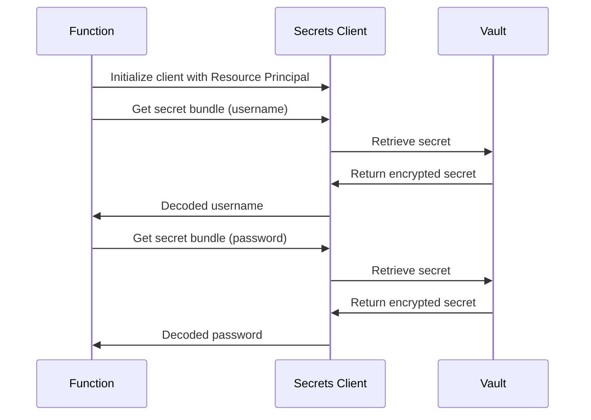

### Phase 5: Email Composition
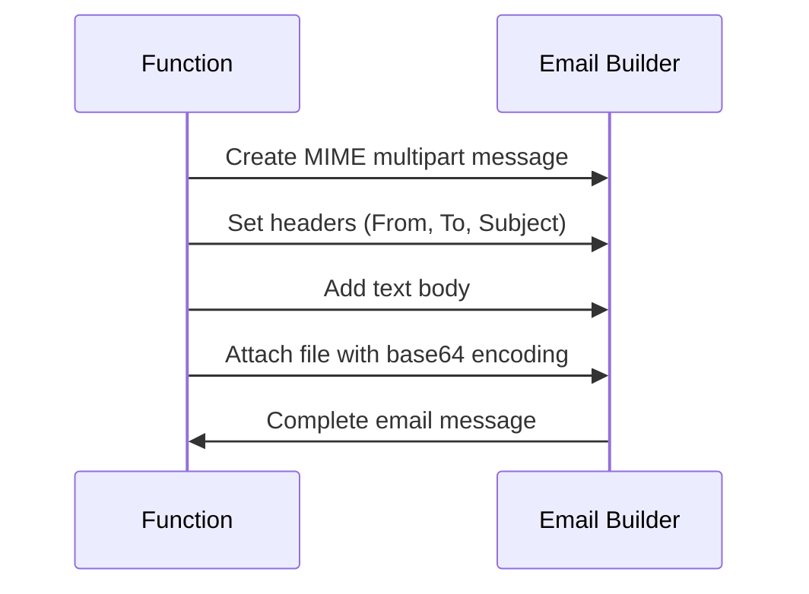

### Phase 6: Email Delivery
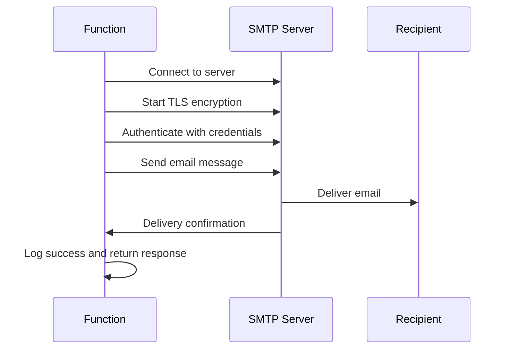

## Security Architecture

### Resource Principal Authentication Flow
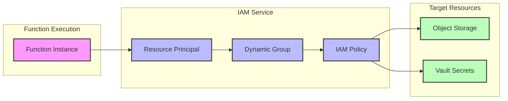

### Permission Matrix
| Resource | Permission | Scope | Purpose |
|----------|------------|-------|---------|
| Object Storage | `read objects` | Specific bucket | Download usage reports |
| Vault Secrets | `read secret-bundles` | Specific vault | Retrieve SMTP credentials |
| Functions | `use fn-invocation` | Compartment | Function execution |
| Object Storage | `read objectstorage-namespaces` | Tenancy | Namespace operations |
| Compartments | `inspect compartments` | Tenancy | Compartment validation |

## Data Flow Architecture

### Input Data Structure
```json
{
  "eventType": "com.oraclecloud.objectstorage.createobject",
  "source": "ObjectStorage",
  "eventTypeVersion": "2.0",
  "eventTime": "2025-06-24T09:00:00Z",
  "data": {
    "compartmentId": "ocid1.compartment.oc1..aaaa...",
    "compartmentName": "root",
    "resourceName": "WeeklyCostsScheduledReport_20250620_0.csv.gz",
    "resourceId": "ocid1.object.oc1..aaaa...",
    "bucketName": "monthly-usage-reports",
    "bucketId": "ocid1.bucket.oc1..aaaa...",
    "namespace": "your-namespace"
  }
}
```

### Function Configuration
```yaml
config:
  BUCKET_NAME: monthly-usage-reports
  EMAIL_FROM: sender@example.com
  EMAIL_TO: recipient@example.com
  NAMESPACE: your-namespace
  REGION: your-region
  SMTP_PASSWORD_SECRET_OCID: ocid1.vaultsecret.oc1..aaaa...
  SMTP_PORT: "587"
  SMTP_SERVER: smtp.email.your-region.oci.oraclecloud.com
  SMTP_USERNAME_SECRET_OCID: ocid1.vaultsecret.oc1..aaaa...
```

### Output Response Structure
```json
{
  "status": "success",
  "message": "Email sent successfully for WeeklyCostsScheduledReport_20250620_0.csv.gz",
  "object_name": "WeeklyCostsScheduledReport_20250620_0.csv.gz",
  "recipient": "recipient@example.com",
  "timestamp": "2025-06-24T09:15:00Z"
}
```

## Error Handling Architecture

### Error Categories and Responses
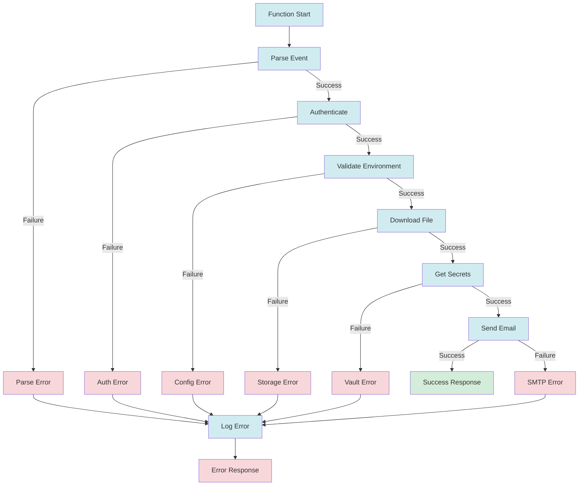

## Deployment Architecture

### Infrastructure Components
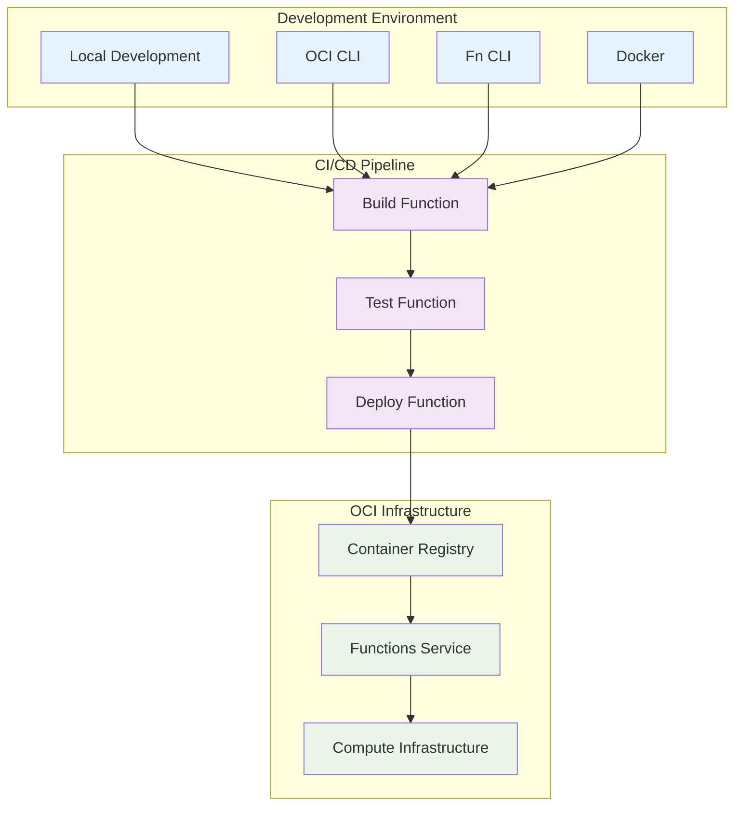

### Deployment Scripts Flow


## Monitoring and Observability

### Logging Architecture
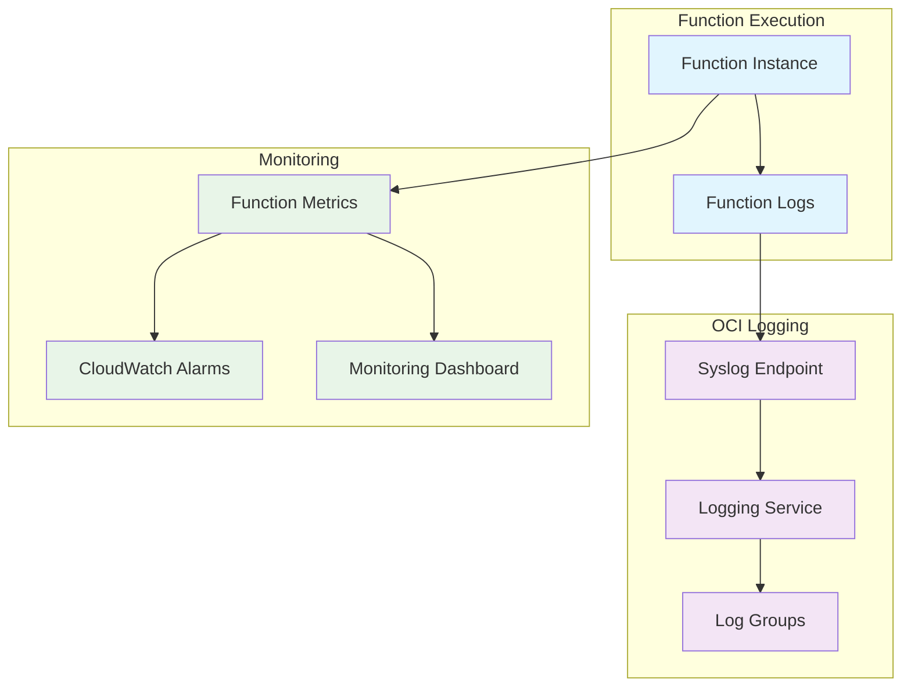

### Key Metrics Tracked
- Function invocation count
- Function execution duration
- Function error rate
- Memory utilization
- Email delivery success rate
- File processing time

## Scalability and Performance

### Auto-scaling Characteristics
- **Concurrent Executions**: Up to 1000 concurrent function instances
- **Memory Allocation**: 512MB per instance (configurable)
- **Timeout**: 120 seconds per execution
- **Cold Start**: ~2-3 seconds for Python runtime
- **Warm Execution**: ~100-500ms

### Performance Optimization
- Resource Principal authentication (no credential lookup)
- Efficient file streaming from Object Storage
- Minimal memory footprint for email composition
- Optimized Docker image with required dependencies only

## Disaster Recovery and High Availability

### Fault Tolerance
- **Multi-AZ Deployment**: Functions automatically distributed across availability domains
- **Automatic Retry**: Event service retries failed function invocations
- **Dead Letter Queue**: Failed events can be routed to DLQ for analysis
- **Circuit Breaker**: Function service handles overload scenarios

### Backup and Recovery
- **Configuration Backup**: All configuration stored in version-controlled scripts
- **Secret Rotation**: Vault secrets can be rotated without function redeployment
- **Infrastructure as Code**: Complete infrastructure reproducible via scripts

This architecture provides a robust, scalable, and secure solution for automated OCI usage report processing and delivery.
